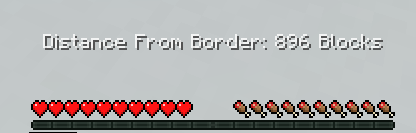

# BC UHC Plugin
### A UHC Plugin for Birdcraft
The plugin adds 4 commands to the game in order to configure and run a UHC event as well as an added functionality to the compass.

## Configure WorldBorder Command

This command is used to display or edit the settings that will be used for the next launch of a UHC game.

Using the command without any other arguments will return a list of the current settings.
 
```sh
  Input: /uhcconfigure or /wbconfigure
  Returns:  Current UHC Settings:
            UHC World Border Starting Size: 2046.0
            UHC World Border Minimum Size: 100.0
            UHC Shrink Duration (seconds): 3600
            UHC World Border Center: [-511.0, 0.0]
            Finale World Border Size: 50.0
            Finale World Border Center: [-381.0, -56.0]
            Finale Teleport Location: [-381.0, 68.0, -57.0]
            Player Spread Range: 1000.0
```

These are the default settings that will be used for a uhc on startup.

You can edit each setting with the same uhcconfigure command.
```
  Input: /uhcconfigure uhcmax <Number>
  Description: Used to edit the size that the worldborder will start at at the beginning of the uhc.
```
```
  Input: /uhcconfigure uhcmin <Number>
  Description: Used to edit the size that the worldborder will shirnk to at the end of the timer.
```
```
  Input: /uhcconfigure uhcduration <Seconds>
  Description: Used to edit how long the uhc will last.
```
```
  Input: /uhcconfigure center <X-coordinate Z-coordinate>
  Description: Used to edit the coordinates of the center of the worldborder during the uhc.
```
```
  Input: /uhcconfigure finalesize <Number>
  Description: Used to edit the size of the worldborder during the finale
```
```
  Input: /uhcconfigure finalecenter <X-coordinate Z-coordinate>
  Description: Used to edit the coordinates of the center of the worldborder during the finale.
```
```
  Input: /uhcconfigure finalelocation <X-coordinate Y-coordinate Z-coordinate>
  Description: Used to edit the location that all players will be telported to at finale.
```
```
  Input: /uhcconfigure spreaddistance <Number>
  Description: Used to edit how far the teams should be from each other.
```
```
  Input: /uhcconfigure spreadrange <Number>
  Description: Used to edit the range of the team spread
```

## Start UHC Command
This command is used to start the uhc event with the settings of the uhcconfigure command.

```
  Input: /startuhc
```
The command will perform the following functions in order:
1. Set spawnpoint for all player to (finalelocation).
2. Spread players using (spreaddistance) and (spreadrange).
3. Clear all players inventory.
4. Set all players gamemode to survival.
5. Give all players a compass.
6. Give all players instant health and saturation 100 for 255 seconds.
7. Set worldborder to start from (uhcmax) and shrink to (uhcmin) over the course of (uhcduration).
8. Display a Bossbar timer at the top of every player's screen
9. Updates Bossbar with time until finale
10. Triggers finale event

## Finale Event
The finale of the uhc is triggered either through a command or automatically when using /startuhc after a set (uhcduration) 

The command is:
```
  Input: /finale
```
Triggering the finale event will perform the following functions in order:
1. Set title of BossBar to Finale.
2. Teleport all players to (finalelocation) after 5 seconds.
3. Give all players instant health and saturation 100 for 255 seconds.
4. Set worldborder size to (finalesize).
5. Set center of the worldborder to (finalecenter)

## End UHC Command
This command can be used to end the event at any point. It is not triggered automatically and must be used manually.
 ```
   Input: /enduhc
 ```
Using this command will perform the following:
1. cancel all timers used in the plugin including the BossBar.
2. Teleport all players to (finalelocation).
3. Set worldborder size to (uhcmax).
4. Remove Bossbar timer from all players screens.

## Compass Functionality
The plugin also adds a unique function to the compass. During the uhc, players can right click the compass in order to see how far form the worldborder they are. This will display above their hotbar as a message.
